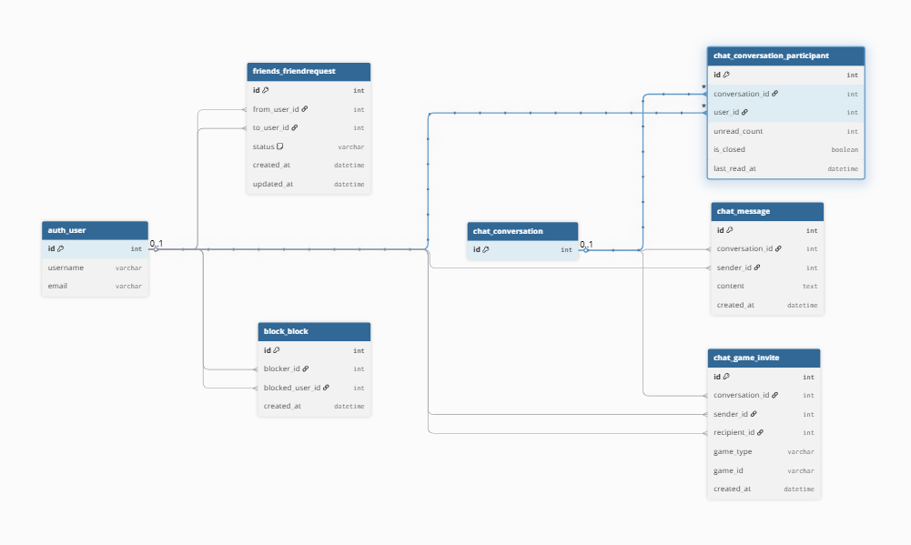
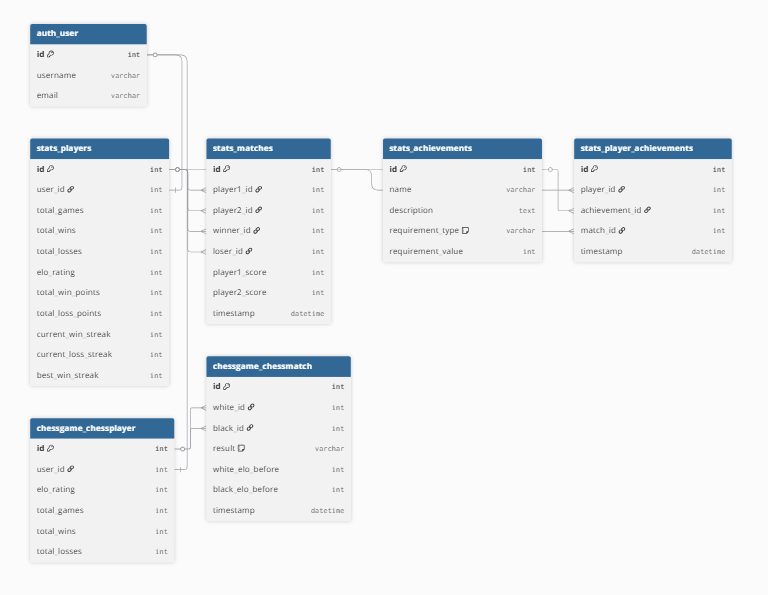
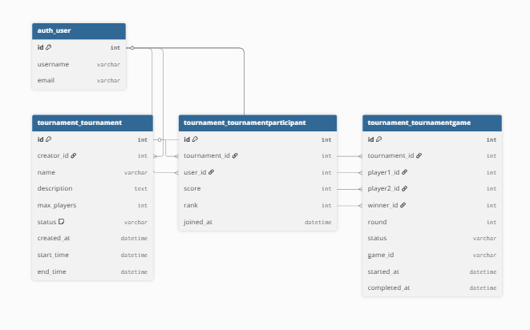

This project has been created as part
of the 42 curriculum by rverhoev, akaya-oz, tfeuer, nsarmada, snijhuis.


# Documentation

## Table of Contents
- [Description](#description)
- [Instructions](#instructions)
- [Resources](#resources)
- [Team Information](#team-information)
- [Project Management](#project-management)
  - [Tools](#tools)
  - [Process](#process)
  - [Onboarding](#onboarding)
  - [Communication Channels](#communication-channels)
- [Technical Stack](#technical-stack)
- [Database Schema](#database-schema)
  - [Chat, Friends & Block](#chat-friends--block)
  - [Pong Stats & Chess](#pong-stats--chess)
  - [Tournament](#tournament)
- [Feature List](#feature-list)
  - [Authentication & Security](#authentication--security)
  - [User Management](#user-management)
  - [Local Pong](#local-pong)
  - [Online Pong](#online-pong)
  - [AI Player](#ai-player)
  - [Tournaments](#tournaments)
  - [Friends](#friends)
  - [Block](#block)
    - [Block REST API](#block-rest-api)
  - [Chat System](#chat-system)
    - [WebSocket Message Protocol](#websocket-message-protocol)
  - [Additional Games](#additional-games)
  - [Graphics & UI](#graphics--ui)
  - [Internationalization (i18n)](#internationalization-i18n)
- [Modules](#modules)
- [Individual Contributions](#individual-contributions)


### Description
<clear name for the project and its
key features>


### Instructions
<all the needed prerequisites (software,
tools, versions, configuration like .env setup, etc.), and step-by-step instructions to
run the project>

**Currently we build and run by: docker compose -d --build**


### Resources
<classic references related to the topic (documentation, articles, tutorials, etc.), as well as a description of how AI was used —
specifying for which tasks and which parts of the project>


### Team Information
<For each team member mentioned at the top of the README.md, you must provide:
◦ Assigned role(s): PO, PM, Tech Lead, Developers, etc.
◦ Brief description of their responsibilities>


### Project Management

The team's project management approach evolved over time, shaped in part by a LeanIT workshop given at Codam by Niels Loader from Eraneos, which introduced Agile and Scrum practices.

#### Tools

The backlog was initially set up on Trello and later migrated to GitHub Projects after the LeanIT workshop, so that issues, code, and project tracking would all live in the same place. User stories were written and maintained as GitHub Issues, with the initial backlog drafted and kept up to date by the PM.

#### Process

The team adopted a one-week sprint cadence, though in practice this was not always strictly followed. A weekly team meeting was scheduled for Mondays at 12:00 to sync on progress, surface blockers, and plan upcoming work.

A code review policy was established early in the project: pull requests must receive at least one approving review before being merged into `main`. The intent was to ensure that no code reaches the main branch without a second pair of eyes, both as a quality safeguard and as a way to spread knowledge across the team.

The structure of this README was also defined as part of the project management work, with individual sections then filled in by their respective owners.

#### Onboarding

As the team grew over the course of the project, onboarding new members was handled collaboratively: walking them through the existing codebase and project structure, explaining the team's processes (review policy, weekly meetings, project board), adding them to the relevant tools (Slack, GitHub repository, GitHub Projects), and pairing with them on their first issues or PRs.

#### Communication Channels

- **Slack** — primary channel for day-to-day discussion, decisions, and quick coordination
- **GitHub issue comments** — for discussion tied to specific user stories or tasks
- **GitHub PR comments** — for code review feedback and technical discussion
- **Weekly meetings** — for synchronous discussion, planning, and decisions


### Technical Stack
<◦ Frontend technologies and frameworks used.
◦ Backend technologies and frameworks used.
◦ Database system and why it was chosen.
◦ Any other significant technologies or libraries.
◦ Justification for major technical choices>


### Database Schema

The database is PostgreSQL. The schema is split into three diagrams by domain.

#### Chat, Friends & Block

Centres on `auth_user`. Friend requests and blocks are direct user-to-user relationships. Chat is built around a `Conversation` container — messages, participants, and game invites all hang off it. `ConversationParticipant` tracks per-user state (unread count, read timestamp, tab visibility).



#### Pong Stats & Chess

Each user gets a `stats_players` profile (auto-created on registration) that accumulates pong stats and ELO. Matches reference players, not users directly. Achievements are defined once in `stats_achievements` and linked to players via `stats_player_achievements`. Chess has its own parallel player and match tables with separate ELO tracking.



#### Tournament

A `Tournament` is created by a user and has many `TournamentParticipant` rows (one per registered player) and many `TournamentGame` rows (one per match in the bracket). Games reference users directly and track round, status, and the external `game_id` used to link to the live pong session.




### Feature List
<◦ Complete list of implemented features.
◦ Which team member(s) worked on each feature.
◦ Brief description of each feature’s functionality>

The following features are implemented:
#### Authentication & Security

#### User Management

#### Local Pong

#### Online Pong

#### AI Player

#### Tournaments

#### Friends

#### Block

##### Block REST API

All endpoints are under `/api/block/`. Authentication via JWT cookie (`access_token`).

###### `POST /api/block/`
Block a user by their user ID. Also removes any existing friendship between the two users.
```json
Request:  { "user_id": 7 }
Response: { "success": true, "message": "You have blocked rik" }
```

###### `DELETE /api/block/unblock`
Unblock a previously blocked user by their user ID.
```json
Request:  { "user_id": 7 }
Response: { "success": true }
```

---

#### Chat System

The chat system is a persistent WebSocket overlay that stays alive across SPA navigation. It handles global chat, direct messages (with the last 50 messages persisted), online presence, game invites, typing indicators, read receipts, block events, game results broadcast to global chat, and profile viewing.

##### UI


The chat window is a fixed overlay rendered in `index.html`, outside the SPA's `#app-root`. It stays mounted and connected across all page navigations. Everything inside it is dynamically rendered by JavaScript:

- **Online users list** — rebuilt every time someone connects, disconnects, or changes game status. Users who blocked you are hidden; users you blocked are still shown so you can unblock them.
- **Channel tabs** — the Global tab is always present. DM tabs are created on the fly when you open a conversation or receive a message from someone you don't have a tab open for yet. Tabs persist across navigation and show an unread badge when new messages arrive.
- **Messages** — kept in memory per channel for the session. DM history (last 50 messages) is fetched from the database when a tab is opened. Global messages are not persisted.
- **Channel title** — updates dynamically when switching between Global and DM tabs.
- **Typing indicator** — appears when the other person is typing, cleared automatically when they stop.
- **Read receipts** — a checkmark or indicator updates when your DM partner has read your messages.
- **Block notice** — replaces the input area when either user has blocked the other, preventing new messages.
- **Character counter** — shows the current character count against the 300 character limit as you type.
- **Game invite UI** — inline invite cards appear in the DM with accept/decline actions. Expired or cancelled invites are cleaned up automatically.
- **Context menu** — clicking an online user opens a menu with four actions: View Profile, Chat, Invite to Game, and Block. Invite to Game opens a game picker submenu to choose between Pong and Chess.

##### WebSocket Message Protocol

All messages are JSON. The `type` field determines the message kind.

**Convention:**
- Frontend → Backend: `snake_case`
- Backend → Frontend: `camelCase`
- Internal Django Channels routing (`group_send`): `dot.separated` — never reaches the frontend

**Frontend → Backend**

###### `send_message`
Send a global or DM message. Omit `recipient_id` for global.
```json
{ "type": "send_message", "message": "hello", "recipient_id": "42" }
```

###### `fetch_history`
Request the last 50 messages from a DM conversation.
```json
{ "type": "fetch_history", "dm_partner_id": "42" }
```

###### `get_open_dms`
Request all open DM tabs (sent on connect to restore tabs).
```json
{ "type": "get_open_dms" }
```

###### `set_active_conversation`
Tell the backend which conversation is currently open. Send `null` partner_id when switching to global.
```json
{ "type": "set_active_conversation", "partner_id": "42" }
```

###### `mark_read`
Reset unread count for a DM conversation.
```json
{ "type": "mark_read", "dm_partner_id": "42" }
```

###### `hide_dm`
Hide a DM tab — it won't reappear on refresh unless a new message arrives.
```json
{ "type": "hide_dm", "dm_partner_id": "42" }
```

###### `send_game_invite`
Send a game invite. `game_type` is `"pong"` or `"chess"`.
```json
{ "type": "send_game_invite", "invitee_id": "42", "game_type": "pong", "game_id": "abc-123" }
```

###### `cancel_game_invite`
Cancel a sent invite.
```json
{ "type": "cancel_game_invite", "invitee_id": "42", "game_id": "abc-123" }
```

###### `accept_game_invite`
Accept a received invite — deletes it from DB and notifies the sender.
```json
{ "type": "accept_game_invite", "game_id": "abc-123" }
```

###### `report_blocked_user`
Notify the backend a user was blocked. Triggers invite cleanup and online users broadcast.
```json
{ "type": "report_blocked_user", "recipient_id": "42" }
```

###### `notify_typing` / `notify_stop_typing`
Notify that the current user started or stopped typing. Omit `typing_recipient_id` for global.
```json
{ "type": "notify_typing", "typing_recipient_id": "42" }
{ "type": "notify_stop_typing", "typing_recipient_id": "42" }
```

**Backend → Frontend**

###### `selfId`
Sent on connect to confirm the user's identity.
```json
{ "type": "selfId", "user_id": "42", "user_name": "tamar" }
```

###### `chatMessage`
Delivers a message. `private: true` for DMs. Sent to all tabs of both sender and recipient.
```json
{ "type": "chatMessage", "message": "hello", "sender_id": "42", "sender_name": "tamar", "private": true, "recipient_id": "7" }
```

###### `dmHistory`
Last 50 messages of a DM conversation, oldest first. `seen` indicates whether the other user has read your last sent message. Invite messages have an empty `message` and an `invite` object instead.
```json
{
  "type": "dmHistory",
  "dm_partner_id": "42",
  "seen": true,
  "messages": [
    { "sender_id": "42", "sender_name": "tamar", "message": "hello", "created_at": "2026-05-10T12:00:00" },
    { "sender_id": "7", "sender_name": "rik", "message": "", "invite": { "gameType": "pong", "gameId": "abc-123" }, "created_at": "2026-05-10T12:01:00" }
  ]
}
```

###### `openDms`
All open DM tabs. Key is the other user's user_id. `unread` is the unread message count. `seen` indicates whether the other user has read your last message.
```json
{
  "type": "openDms",
  "dms": {
    "42": { "user_name": "tamar", "unread": 3, "seen": false },
    "7":  { "user_name": "rik",   "unread": 0, "seen": true  }
  }
}
```

###### `messagesSeenByDmPartner`
Your DM partner has read your messages.
```json
{ "type": "messagesSeenByDmPartner", "by": "42" }
```

###### `onlineUsers`
Personalized online users list sent to every user on connect/disconnect/game status change. `users` excludes users who blocked you. Users you blocked are still included so you can unblock them.
```json
{
  "type": "onlineUsers",
  "users": { "42": "tamar", "7": "rik" },
  "blocked_by_me_ids": ["7"],
  "blocked_me_ids": [],
  "in_game_ids": ["42"]
}
```

###### `gameInvite`
You received a game invite.
```json
{ "type": "gameInvite", "sender_id": "42", "sender_name": "tamar", "game_type": "pong", "game_id": "abc-123" }
```

###### `gameInviteExpired`
An invite you received was cancelled by the sender.
```json
{ "type": "gameInviteExpired", "game_id": "abc-123" }
```

###### `gameInviteAccepted`
An invite you sent was accepted.
```json
{ "type": "gameInviteAccepted", "game_id": "abc-123" }
```

###### `gameInviteBlocked`
An invite was cancelled because you blocked the other user.
```json
{ "type": "gameInviteBlocked", "game_id": "abc-123" }
```

###### `gameInviteRejected`
Your invite was rejected because one of the users is already in a game.
```json
{ "type": "gameInviteRejected", "reason": "in_game" }
```

###### `gameResult`
A game ended. Broadcast to all connected users. For draws, `winner` and `loser` are `null` and `draw_players` contains both usernames.
```json
{ "type": "gameResult", "winner": "tamar", "loser": "rik", "draw_players": null, "game_type": "pong" }
```

###### `friendListChanged`
Your friend list changed. Frontend should re-fetch.
```json
{ "type": "friendListChanged" }
```

###### `otherTyping` / `otherStoppedTyping`
Someone started or stopped typing. `private: true` for DMs, `false` for global.
```json
{ "type": "otherTyping", "typer_id": "42", "typer_name": "tamar", "private": true }
{ "type": "otherStoppedTyping", "typer_id": "42", "typer_name": "tamar", "private": false }
```

#### Additional Games

#### Graphics & UI

#### Internationalization (i18n)
The project has a custom i18n (internationalization) system.

Supported Languages:
- English (en)
- Dutch (nl)
- Turkish (tr)

**TODO (remove before final submission)**  
How to add new translatable text:

1. Add your translation key to: `frontend/src/i18n/keys.js`
   Example: `MY_NEW_TEXT = 'MY_NEW_TEXT',`

2. Add the English text for this key to: `frontend/src/i18n/translations/en.js`
   Example: `[TranslationKey.MY_NEW_TEXT]: 'My English text',`

3. (if possible) add translations for all other languages (nl.js, tr.js)

How to use translations in Javascript:
```javascript
import { initI18n, t, TranslationKey, updatePageTranslations, setLanguage, getCurrentLanguage, Language } from "./i18n";
```

How to use translations in HTML:
```html
<button data-i18n="BTN_START_GAME">START GAME</button>
```
The text will automatically update when language changes.
Frontend bottom-left corner has a language selector dropdown.


### Modules
<◦ List of all chosen modules (Major and Minor).
◦ Point calculation (Major = 2pts, Minor = 1pt).
◦ Justification for each module choice, especially for custom "Modules of
choice".
◦ How each module was implemented.
◦ Which team member(s) worked on each module>


### Individual Contributions
<◦ Detailed breakdown of what each team member contributed.
◦ Specific features, modules, or components implemented by each person.
◦ Any challenges faced and how they were overcome.
Any other useful or relevant information is welcome (usage documentation, known
limitations, license, credits, etc.)>
