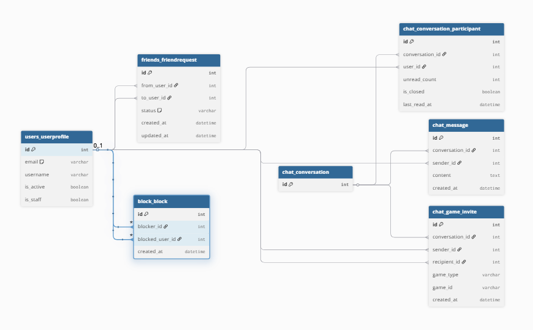
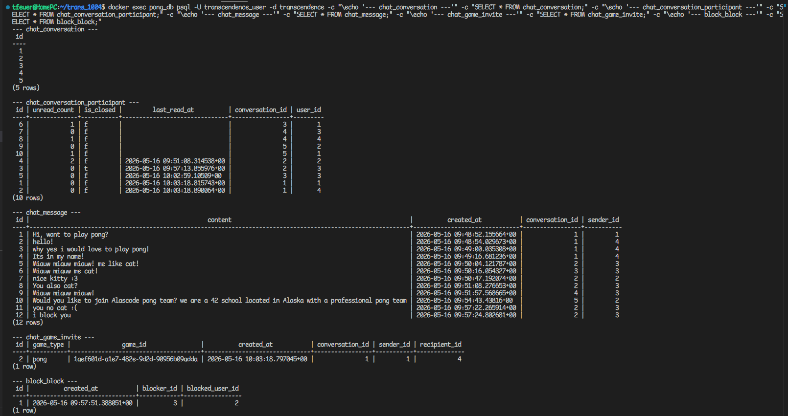
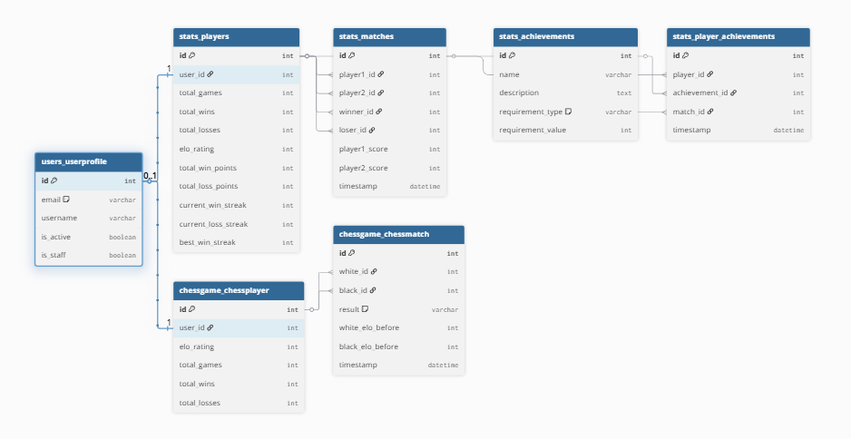
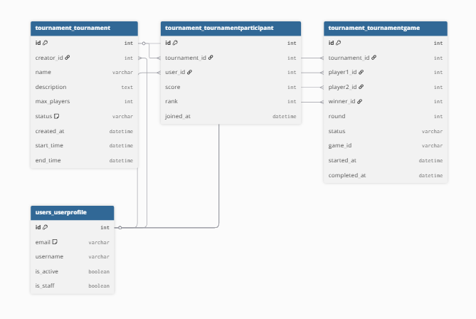
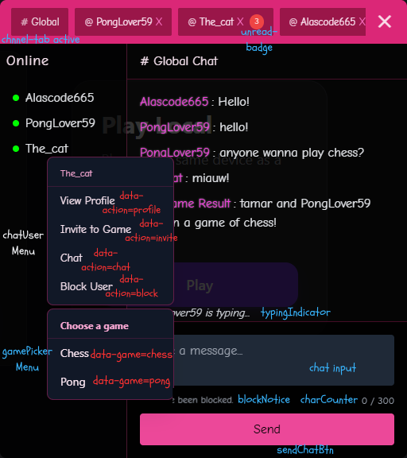

This project has been created as part
of the 42 curriculum by rverhoev, akaya-oz, tfeuer, nsarmada, snijhuis.


# Documentation

## Table of Contents
- [Description](#description)
- [Instructions](#instructions)
- [Resources](#resources)
- [Team Information](#team-information)
- [Project Management](#project-management)
  - [Tools](#tools)
  - [Process](#process)
  - [Onboarding](#onboarding)
  - [Communication Channels](#communication-channels)
- [Technical Stack](#technical-stack)
- [Database Schema](#database-schema)
  - [Chat, Friends & Block](#chat-friends--block)
  - [Pong Stats & Chess](#pong-stats--chess)
  - [Tournament](#tournament)
- [Feature List](#feature-list)
  - [Authentication & Security](#authentication--security)
  - [User Management](#user-management)
  - [Local Pong](#local-pong)
  - [Online Pong](#online-pong)
  - [AI Player](#ai-player)
  - [Tournaments](#tournaments)
  - [Chess](#chess)
    - [Chess REST API](#chess-rest-api)
    - [Chess WebSocket Protocol](#chess-websocket-protocol)
  - [Friends](#friends)
    - [Friends REST API](#friends-rest-api)
  - [Block](#block)
    - [Block REST API](#block-rest-api)
  - [Chat System](#chat-system)
    - [UI](#ui)
    - [WebSocket Message Protocol](#websocket-message-protocol)
  - [Additional Games](#additional-games)
  - [Graphics & UI](#graphics--ui)
  - [Internationalization (i18n)](#internationalization-i18n)
- [Modules](#modules)
- [Individual Contributions](#individual-contributions)


### Description
<clear name for the project and its
key features>


### Instructions
<all the needed prerequisites (software,
tools, versions, configuration like .env setup, etc.), and step-by-step instructions to
run the project>

**Currently we build and run by: docker compose -d --build**


### Resources
<classic references related to the topic (documentation, articles, tutorials, etc.), as well as a description of how AI was used —
specifying for which tasks and which parts of the project>

- [MDN — WebSocket API](https://developer.mozilla.org/en-US/docs/Web/API/WebSocket) — browser-side WebSocket interface (`readyState`, `send`, `onmessage`, etc.)
- [Django Channels](https://channels.readthedocs.io/en/latest/) — async WebSocket support for Django (`AsyncWebsocketConsumer`, channel layers, `database_sync_to_async`)


### Team Information
<For each team member mentioned at the top of the README.md, you must provide:
◦ Assigned role(s): PO, PM, Tech Lead, Developers, etc.
◦ Brief description of their responsibilities>


### Project Management

The team's project management approach evolved over time, shaped in part by a LeanIT workshop given at Codam by Niels Loader from Eraneos, which introduced Agile and Scrum practices.

#### Tools

The backlog was initially set up on Trello and later migrated to GitHub Projects after the LeanIT workshop, so that issues, code, and project tracking would all live in the same place. User stories were written and maintained as GitHub Issues, with the initial backlog drafted and kept up to date by the PM.

#### Process

The team adopted a one-week sprint cadence, though in practice this was not always strictly followed. A weekly team meeting was scheduled for Mondays at 12:00 to sync on progress, surface blockers, and plan upcoming work.

A code review policy was established early in the project: pull requests must receive at least one approving review before being merged into `main`. The intent was to ensure that no code reaches the main branch without a second pair of eyes, both as a quality safeguard and as a way to spread knowledge across the team.

The structure of this README was also defined as part of the project management work, with individual sections then filled in by their respective owners.

#### Onboarding

As the team grew over the course of the project, onboarding new members was handled collaboratively: walking them through the existing codebase and project structure, explaining the team's processes (review policy, weekly meetings, project board), adding them to the relevant tools (Slack, GitHub repository, GitHub Projects), and pairing with them on their first issues or PRs.

#### Communication Channels

- **Slack** — primary channel for day-to-day discussion, decisions, and quick coordination
- **GitHub issue comments** — for discussion tied to specific user stories or tasks
- **GitHub PR comments** — for code review feedback and technical discussion
- **Weekly meetings** — for synchronous discussion, planning, and decisions


### Technical Stack
<◦ Frontend technologies and frameworks used.
◦ Backend technologies and frameworks used.
◦ Database system and why it was chosen.
◦ Any other significant technologies or libraries.
◦ Justification for major technical choices>


### Database Schema

The database is PostgreSQL. The schema is split into three diagrams by domain.

#### Chat, Friends & Block

Centres on `auth_user`. Friend requests and blocks are direct user-to-user relationships. Chat is built around a `Conversation` container — messages, participants, and game invites all hang off it. `ConversationParticipant` tracks per-user state (unread count, read timestamp, tab visibility).



##### Example Data

Sample data from a test session (users: tamar=1, Alascode331=2, The_cat=3, PongLover59=4):



#### Pong Stats & Chess

Each user gets a `stats_players` profile (auto-created on registration) that accumulates pong stats and ELO. Matches reference players, not users directly. Achievements are defined once in `stats_achievements` and linked to players via `stats_player_achievements`. Chess has its own parallel player and match tables with separate ELO tracking.



#### Tournament

A `Tournament` is created by a user and has many `TournamentParticipant` rows (one per registered player) and many `TournamentGame` rows (one per match in the bracket). Games reference users directly and track round, status, and the external `game_id` used to link to the live pong session.




### Feature List
<◦ Complete list of implemented features.
◦ Which team member(s) worked on each feature.
◦ Brief description of each feature’s functionality>

The following features are implemented:
#### Authentication & Security

#### User Management

#### Local Pong

#### Online Pong

#### AI Player

#### Tournaments

#### Chess

Chess is implemented as a second game mode alongside Pong. Players switch between Pong and Chess from the home hub (`/`). The frontend uses [chess.js](https://github.com/jhlywa/chess.js) for rules and move validation in the browser; the backend uses [python-chess](https://python-chess.readthedocs.io/) as the source of truth for online games. Piece graphics are Cburnett-style SVGs in `frontend/public/chess-pieces/`.

**Modes:**

| Mode | Route | Auth | Description |
|------|-------|------|-------------|
| Local (hot-seat) | `/chess` | Required | Two players on one device; rules enforced client-side only. |
| Online matchmaking | `/chess-online` | Required | Join or create a lobby via REST, then play over WebSocket. |
| Friend invite | `/chess-online?gameId=…` | Required | Invitor creates a private session via chat; invitee accepts and connects to the same `gameId`. |

Online play is only entered intentionally: the home **Online Game** button sets a flag before navigation, or the user follows an invite link with `gameId` in the query string. A bare refresh or direct visit to `/chess-online` without either is redirected away.

Active chess sessions mark both players in `IN_GAME_USERS` (shared with Pong and chat), which blocks duplicate games and updates the chat online list. Game results are broadcast on the global chat WebSocket as `gameResult` with `game_type: "chess"`.

##### Chess REST API

All endpoints are under `/api/chess/`. Authentication via JWT cookie (`access_token`), same as other protected APIs.

###### `POST /api/chess/join/`

Create a new game or join an open waiting lobby (matchmaking). For friend invites, pass the invitee’s user ID; the session is invite-only until that user joins.

```json
Request (matchmaking):  {}
Request (invite):       { "invitee_id": 42 }
Response:               { "gameId": "a1b2c3d4-..." }
```

Matchmaking skips sessions that already have an `invitee_id` (invite-only tables). Colors are assigned when the session is created (random for the creator) or when the second player joins; the WebSocket connect order does not decide colors.

###### `GET /api/chess/stats/`

Current user’s chess record. Returns defaults if the user has never played.

```json
Response: {
  "total_games": 12,
  "total_wins": 7,
  "total_losses": 5,
  "elo_rating": 1248
}
```

###### `GET /api/chess/leaderboard/`

Top 10 players by ELO (public).

```json
Response: {
  "leaderboard": [
    { "username": "tamar", "elo_rating": 1350, "total_wins": 20, "total_games": 30 }
  ]
}
```

###### `GET /api/chess/match-history/`

Last 20 matches for the authenticated user.

```json
Response: {
  "matches": [
    {
      "white": "tamar",
      "black": "rik",
      "opponent": "rik",
      "result": "1-0",
      "winner": "tamar",
      "timestamp": "2026-05-10T14:30:00.123456+00:00"
    }
  ]
}
```

`result` uses standard chess notation: `1-0`, `0-1`, `1/2-1/2`, or `abandonment` when a player disconnects mid-game.

The stats page is at `/chess-stats` (linked from the profile). Profile also shows chess wins, losses, and ELO when available.

---

##### Chess WebSocket Protocol

**Endpoint:** `ws(s)://<host>/ws/chess/<game_id>/`

Authenticated via `TokenAuthMiddleware` (JWT from cookies on the WebSocket handshake). After connect, the server assigns `white` or `black` and broadcasts game state to the `chess_<game_id>` channel group.

**Close codes:**

| Code | Meaning |
|------|---------|
| `4004` | Unknown or expired `game_id` |
| `4003` | Not a participant, table full, or user already in another active game |

---

**Frontend → Backend**

###### `move`

Send a move in UCI form (`from` + `to` squares, optional promotion). Only accepted when it is your turn and the game is `active`.

```json
{ "type": "move", "from": "e2", "to": "e4" }
{ "type": "move", "from": "e7", "to": "e8", "promotion": "q" }
```

Illegal moves receive a direct `illegal_move` message to the sender only (not broadcast).

---

**Backend → Frontend**

###### `assign`

Sent immediately after a successful connect.

```json
{ "type": "assign", "color": "white" }
```

###### `gameStart`

Both players connected; game is active. Board orientation: black’s client flips the view.

```json
{
  "type": "gameStart",
  "fen": "rnbqkbnr/pppppppp/8/8/8/8/PPPPPPPP/RNBQKBNR w KQkq - 0 1",
  "white": "tamar",
  "black": "rik",
  "white_elo": 1200,
  "black_elo": 1185
}
```

###### `gameState`

Broadcast after every legal move.

```json
{
  "type": "gameState",
  "fen": "...",
  "turn": "black"
}
```

###### `gameOver`

Game ended (checkmate, draw, stalemate, or abandonment).

```json
{ "type": "gameOver", "winner": "white", "result": "1-0" }
{ "type": "gameOver", "winner": null, "result": "1/2-1/2" }
{ "type": "gameOver", "winner": "black", "result": "abandonment" }
```

On game over, ELO is updated (K-factor 40), a `ChessMatch` row is persisted, the in-memory `ChessSession` is removed, and a `gameResult` event is sent on global chat.

---

**Implementation notes**

- **In-memory games:** Active boards live in `ChessSession._games` (not the database). Only finished games are stored in `ChessMatch` / `ChessPlayer`.
- **ELO:** Default rating 1200; draws update both players with result `0.5` but are not counted separately in win/loss totals on `ChessPlayer`.
- **Chat invites:** Invitor calls `POST /api/chess/join/` with `invitee_id`, sends a chat `send_game_invite` with `game_type: "chess"`, and opens `/chess-online?gameId=…`. Acceptor uses the invite link in the DM; accepting clears competing invites when the game starts.
- **Frontend modules:** `frontend/src/chess/chess.js` (local + shared board UI), `chess-online.js` (WebSocket client), `chess-modal.js` (result overlay). Leaving `/chess-online` closes the socket via `closeChessConnection()` in the router.

#### Friends

Friends are managed from your own profile (`/profile`). Other users’ profiles (`/profile/:username`) show stats and match history only — friend actions are not available there.

Friendships are stored as a single `FriendRequest` row between two users with `status: "accepted"`. Pending and declined requests use the same model. There is no separate friends join table.

**UI flow (own profile):**

| Section | Action |
|---------|--------|
| Add Friend | Enter a username and send a request (`POST /api/friends/send`). |
| Pending Requests | Incoming requests with Accept / Decline. |
| Friends | List of accepted friends, sorted online first (using the chat `onlineUsers` map), with Remove per friend. |

**Business rules:**

- Cannot send a request to yourself.
- Cannot send if either user has blocked the other (`is_blocked` from the block app).
- Cannot send if already friends (an accepted request exists in either direction).
- Cannot send a duplicate outgoing request while one is still `pending` (declined requests can be sent again).
- **Mutual pending auto-accept:** If user B already sent a pending request to user A, and A sends a request to B, the existing request is accepted immediately (both become friends without B pressing Accept).
- **Blocking removes friendship:** `POST /api/block/` deletes any accepted `FriendRequest` between the two users (see [Block](#block)).

**Real-time updates:** The profile page listens for the browser event `friendListChanged`. Chat WebSocket delivers `{ "type": "friendListChanged" }` after a block is reported (`report_blocked_user`), which triggers a friends list refresh. Accept/decline/remove also re-render the list directly after the REST call succeeds.

**Frontend modules:** `frontend/src/users_friends/friends.js` (API helpers), `profilePage.js` (UI). All requests use `fetchWithRefreshAuth` (JWT cookies + token refresh).

---

##### Friends REST API

All endpoints are under `/api/friends/`. Authentication via JWT cookie (`access_token`).

###### `POST /api/friends/send`

Send a friend request by target username.

```json
Request:  { "to_username": "rik" }
Response: { "success": true, "message": "Friend request sent to rik" }
```

Possible errors: `400` (self-request, already friends, pending duplicate, blocked), `404` (user not found), `401` (not authenticated).

Auto-accept response when the other user already has a pending request to you:

```json
Response: { "success": true, "message": "You are now friends with rik" }
```

###### `GET /api/friends/pending`

List incoming pending requests for the authenticated user.

```json
Response: {
  "requests": [
    { "id": 3, "from_user__username": "tamar", "status": "pending" }
  ]
}
```

###### `POST /api/friends/accept`

Accept a pending request. Only the recipient (`to_user`) may accept.

```json
Request:  { "request_id": 3 }
Response: { "success": true }
```

Errors: `403` (not your request), `400` (already processed), `404` (request not found).

###### `POST /api/friends/delete`

Decline a pending request (sets status to `declined`). Only the recipient may decline.

```json
Request:  { "request_id": 3 }
Response: { "success": true }
```

###### `GET /api/friends/list`

Return all accepted friends of the authenticated user.

```json
Response: {
  "friends": [
    { "id": 7, "username": "rik" },
    { "id": 42, "username": "tamar" }
  ]
}
```

The frontend splits this list into online vs offline using chat presence (`onlineUsers`).

###### `POST /api/friends/remove`

Remove an accepted friendship by the other user’s ID. Deletes the `FriendRequest` row (either direction).

```json
Request:  { "friend_id": 7 }
Response: {
  "success": true,
  "message": "You have successfully removed rik from your friends list"
}
```

---

**Data model (`friends.FriendRequest`):**

| Field | Description |
|-------|-------------|
| `from_user` | User who sent the request |
| `to_user` | User who receives the request |
| `status` | `pending`, `accepted`, or `declined` |
| `created_at` / `updated_at` | Timestamps |

#### Block

Blocking is available from the chat context menu (right-click an online user). Blocks are stored as a `Block` row in the database.

**Business rules:**

- Blocking a user removes any existing friendship between the two users.
- Once blocked, neither the blocker nor the blocked user can send messages to each other. The chat input is replaced with a notice: _"You have blocked this user."_ for the blocker and _"You have been blocked."_ for the blocked user.
- If either user closes the DM tab after a block, they cannot reopen it until the block is lifted.
- Blocking does not interrupt an ongoing game. If a game is already in progress, it continues to completion. This prevents blocking from being used as a way to abandon a losing game.
- Users you have blocked are still visible in the online users list so you can unblock them. Users who blocked you are hidden from your list.

**Real-time updates:** After a block is saved via the REST API, the frontend calls `reportBlockedUser()` over the chat WebSocket. This notifies the consumer to cancel any pending game invites between the two users, broadcast an updated online users list, and send `friendListChanged` to both users.

---

##### Block REST API

All endpoints are under `/api/block/`. Authentication via JWT cookie (`access_token`).

###### `POST /api/block/`
Block a user by their user ID. Also removes any existing friendship between the two users.
```json
Request:  { "user_id": 7 }
Response: { "success": true, "message": "You have blocked rik" }
```

###### `DELETE /api/block/unblock`
Unblock a previously blocked user by their user ID.
```json
Request:  { "user_id": 7 }
Response: { "success": true }
```

---

#### Chat System

The chat system is a persistent WebSocket overlay that stays alive across SPA navigation. It handles global chat, direct messages (with the last 50 messages persisted), online presence, game invites, typing indicators, read receipts, block events, game results broadcast to global chat, and profile viewing.

##### UI



**DOM structure of `chatContainer`:**
```
chatContainer
├── chatHeader
│   ├── channelTabs        (Global tab + DM tabs)
│   └── closeChatBtn
└── chatContent
    ├── usersSidebar
    │   └── onlineUsersList
    └── chatPanel
        ├── channelTitle
        ├── chatMessages
        ├── typingIndicator
        └── chatInputWrapper
            ├── chatInput
            ├── blockNotice
            ├── charCounter
            └── sendChatBtn
```

The chat window is a fixed overlay rendered in `index.html`, outside the SPA's `#app-root`. It stays mounted and connected across all page navigations. Everything inside it is dynamically rendered by JavaScript:

- **Online users list**: rebuilt every time someone connects, disconnects, or changes game status. Users who blocked you are hidden; users you blocked are still shown so you can unblock them.
- **Channel tabs**: the Global tab is always present. DM tabs are created on the fly when you open a conversation or receive a message from someone you don't have a tab open for yet. Tabs persist across navigation and show an unread badge when new messages arrive.
- **Messages**: kept in memory per channel for the session. When a DM tab is opened, the backend returns up to the last 50 messages — that's the initial seed for the in-memory store; new messages received afterwards are appended on top, so the store grows beyond 50 over the lifetime of the session. Global messages are ephemeral — they are not persisted and are lost on refresh or reconnect. The message list (`renderMessages()`) re-renders in six situations:
  1. The user switches to a different tab.
  2. The UI language is changed (to update invite card text, Accept/Reject buttons, and the "Me" label).
  3. A new message arrives for the currently-viewed channel.
  4. DM history is received from the backend for the active tab.
  5. A game invite card is removed from history (because the invite expired or was cancelled).
  6. The DM partner reads your messages (updates the "Seen" indicator).
- **Channel title**: updates dynamically when switching between Global and DM tabs.
- **Typing indicator**: appears when the other person is typing, cleared automatically when they stop.
- **Read receipts**: a checkmark or indicator updates when your DM partner has read your messages.
- **Block notice**: replaces the input area when either user has blocked the other, preventing new messages.
- **Character counter**: shows the current character count against the 300 character limit as you type.
- **Game invite UI**: inline invite cards appear in the DM with accept/decline actions. Expired or cancelled invites are cleaned up automatically.
- **Context menu**: clicking an online user opens a menu with four actions:
  - **View Profile**: navigates to that user's profile page.
  - **Chat**: opens a DM tab with that user.
  - **Invite to Game**: opens a game picker submenu (Pong or Chess). Sends a game invite to the user's DM; the invite appears as a card with Accept/Decline. If accepted, both users are navigated to the game. Invites expire if the sender cancels or either user goes offline.
  - **Block**: blocks the user (see [Block](#block)).
- **Game results**: when a Pong or Chess game ends, the result is broadcast to all connected users as a message in Global chat (e.g. _"tamar beat rik in Chess"_).

##### WebSocket Message Protocol

All messages are JSON. The `type` field determines the message kind.

**Convention:**
- Frontend → Backend: `snake_case`
- Backend → Frontend: `camelCase`
- Internal Django Channels routing (`group_send`): `dot.separated` — never reaches the frontend

**Frontend → Backend**

###### `get_open_dms_metadata`
Request metadata for all open DM tabs — user_name, unread count, and seen status per tab (sent on connect to restore tabs). Does not include the messages themselves.
```json
{ "type": "get_open_dms_metadata" }
```
**Frontend:** `fetchOpenDmsMetadata()` in `chat.js`, called automatically after `selfId` is received  
**Backend:** `receive()` → `get_open_dms_metadata` branch → `get_open_dms_metadata()` in `db.py`

###### `fetch_history`
Request the last 50 messages from a DM conversation.
```json
{ "type": "fetch_history", "dm_partner_id": "42" }
```
**Frontend:** `fetchDMHistory()` in `chat.js`  
**Backend:** `receive()` → `fetch_history` branch → `get_dm_history()` in `db.py`

###### `set_active_conversation`
Tell the backend which conversation is currently open. Send `null` partner_id when switching to global.
```json
{ "type": "set_active_conversation", "partner_id": "42" }
```
**Frontend:** `setActiveConversation()` in `chat.js`  
**Backend:** `receive()` → `set_active_conversation` branch in `consumers.py`

###### `mark_read`
Reset unread count for a DM conversation.
```json
{ "type": "mark_read", "dm_partner_id": "42" }
```
**Frontend:** `markRead()` in `chat.js`  
**Backend:** `receive()` → `mark_read` branch → `mark_read()` in `db.py`

###### `send_message`
Send a global or DM message. Omit `recipient_id` for global.
```json
{ "type": "send_message", "message": "hello", "recipient_id": "42" }
```
**Frontend:** `sendChatMessage()` in `chat.js`  
**Backend:** `receive()` → `send_message` branch in `consumers.py`

###### `notify_typing` / `notify_stop_typing`
Notify that the current user started or stopped typing. Omit `typing_recipient_id` for global.
```json
{ "type": "notify_typing", "typing_recipient_id": "42" }
{ "type": "notify_stop_typing", "typing_recipient_id": "42" }
```
**Frontend:** `initTyping()` in `chat.js`  
**Backend:** `receive()` → `notify_typing` / `notify_stop_typing` branch in `consumers.py`

###### `hide_dm`
Hide a DM tab, it won't reappear on refresh unless a new message arrives.
```json
{ "type": "hide_dm", "dm_partner_id": "42" }
```
**Frontend:** `hideDm()` in `chat.js`  
**Backend:** `receive()` → `hide_dm` branch → `hide_dm()` in `db.py`

###### `send_game_invite`
Send a game invite. `game_type` is `"pong"` or `"chess"`.
```json
{ "type": "send_game_invite", "invitee_id": "42", "game_type": "pong", "game_id": "abc-123" }
```
**Frontend:** `sendGameInvite()` in `chat.js`  
**Backend:** `receive()` → `send_game_invite` branch → `save_invite()` in `db.py`

###### `cancel_game_invite`
Cancel a sent invite.
```json
{ "type": "cancel_game_invite", "invitee_id": "42", "game_id": "abc-123" }
```
**Frontend:** `cancelGameInvite()` in `chat.js`  
**Backend:** `receive()` → `cancel_game_invite` branch → `delete_invite()` in `db.py`

###### `accept_game_invite`
Accept a received invite — deletes it from DB and notifies the sender.
```json
{ "type": "accept_game_invite", "game_id": "abc-123" }
```
**Frontend:** `acceptGameInvite()` in `chat.js`  
**Backend:** `receive()` → `accept_game_invite` branch → `delete_invite()` in `db.py`

###### `report_blocked_user`
Notify the backend a user was blocked. Triggers invite cleanup and online users broadcast.
```json
{ "type": "report_blocked_user", "recipient_id": "42" }
```
**Frontend:** `reportBlockedUser()` in `chat.js`  
**Backend:** `receive()` → `report_blocked_user` branch in `consumers.py`

**Backend → Frontend**

###### `selfId`
Sent on connect to confirm the user's identity.
```json
{ "type": "selfId", "user_id": "42", "user_name": "tamar" }
```
**Backend:** `connect()` in `consumers.py`  
**Frontend:** `case "selfId"` in `chatSocket.onmessage` in `chat.js`

###### `openDmsMetadata`
Metadata for all open DM tabs — user_name, unread count, and seen status per tab. Key is the other user's user_id. `unread_count` is the unread message count. `seen` indicates whether the other user has read your last message. Does not include the messages themselves.
```json
{
  "type": "openDmsMetadata",
  "dms_metadata": {
    "42": { "user_name": "tamar", "unread_count": 3, "seen": false },
    "7":  { "user_name": "rik",   "unread_count": 0, "seen": true  }
  }
}
```
**Backend:** `get_open_dms_metadata` branch → `get_open_dms_metadata()` in `db.py`  
**Frontend:** `case "openDmsMetadata"` → dispatches `openDmsMetadataReceived` event → `ensureDMTab()` in `chat-ui.js`

###### `onlineUsers`
Personalized online users list sent to every user on connect/disconnect/game status change. `users` excludes users who blocked you. Users you blocked are still included so you can unblock them.
```json
{
  "type": "onlineUsers",
  "users": { "42": "tamar", "7": "rik" },
  "blocked_by_me_ids": ["7"],
  "blocked_me_ids": [],
  "in_game_ids": ["42"]
}
```
**Backend:** `broadcast_online_users()` → `online_users()` in `consumers.py`  
**Frontend:** `case "onlineUsers"` → dispatches `onlineUsersUpdated` event → `renderOnlineUsers()` in `chat-ui.js`

###### `dmHistory`
Last 50 messages of a DM conversation, oldest first. `seen` indicates whether the other user has read your last sent message. Invite messages have an empty `message` and an `invite` object instead.
```json
{
  "type": "dmHistory",
  "dm_partner_id": "42",
  "seen": true,
  "messages": [
    { "sender_id": "42", "sender_name": "tamar", "message": "hello", "created_at": "2026-05-10T12:00:00" },
    { "sender_id": "7", "sender_name": "rik", "message": "", "invite": { "gameType": "pong", "gameId": "abc-123" }, "created_at": "2026-05-10T12:01:00" }
  ]
}
```
**Backend:** `fetch_history` branch → `get_dm_history()` in `db.py`  
**Frontend:** `case "dmHistory"` → dispatches `dmHistoryReceived` event in `chat.js`

###### `messagesSeenByDmPartner`
Your DM partner has read your messages.
```json
{ "type": "messagesSeenByDmPartner", "read_by": "42" }
```
**Backend:** `messages_read()` in `consumers.py`  
**Frontend:** `case "messagesSeenByDmPartner"` in `chat.js`

###### `chatMessage`
Delivers a message. `private: true` for DMs. Sent to all tabs of both sender and recipient.
```json
{ "type": "chatMessage", "message": "hello", "sender_id": "42", "sender_name": "tamar", "private": true, "recipient_id": "7" }
```
**Backend:** `chat_message()` in `consumers.py`  
**Frontend:** `case "chatMessage"` → dispatches `chatMessageReceived` event → `addMessage()` in `chat-ui.js`

###### `otherTyping` / `otherStoppedTyping`
Someone started or stopped typing. `private: true` for DMs, `false` for global.
```json
{ "type": "otherTyping", "typer_id": "42", "typer_name": "tamar", "private": true }
{ "type": "otherStoppedTyping", "typer_id": "42", "typer_name": "tamar", "private": false }
```
**Backend:** `typing_notification()` in `consumers.py`  
**Frontend:** `case "otherTyping"` / `case "otherStoppedTyping"` → dispatches `typingStarted` / `typingStopped` event in `chat.js`

###### `gameInvite`
You received a game invite.
```json
{ "type": "gameInvite", "sender_id": "42", "sender_name": "tamar", "game_type": "pong", "game_id": "abc-123" }
```
**Backend:** `game_invite()` in `consumers.py`  
**Frontend:** `case "gameInvite"` → dispatches `gameInviteReceived` event in `chat.js`

###### `gameInviteExpired`
An invite you received was cancelled by the sender.
```json
{ "type": "gameInviteExpired", "game_id": "abc-123" }
```
**Backend:** `game_invite_expired()` in `consumers.py`  
**Frontend:** `case "gameInviteExpired"` → dispatches `gameInviteExpired` event in `chat.js`

###### `gameInviteAccepted`
An invite you sent was accepted.
```json
{ "type": "gameInviteAccepted", "game_id": "abc-123" }
```
**Backend:** `game_invite_accepted()` in `consumers.py`  
**Frontend:** `case "gameInviteAccepted"` → dispatches `gameInviteAccepted` event in `chat.js`

###### `gameInviteBlocked`
An invite was cancelled because you blocked the other user.
```json
{ "type": "gameInviteBlocked", "game_id": "abc-123" }
```
**Backend:** `game_invite_blocked()` in `consumers.py`  
**Frontend:** `case "gameInviteBlocked"` → dispatches `gameInviteBlocked` event in `chat.js`

###### `gameInviteRejected`
Your invite was rejected because one of the users is already in a game.
```json
{ "type": "gameInviteRejected", "reason": "in_game" }
```
**Backend:** `receive()` → `send_game_invite` branch in `consumers.py`  
**Frontend:** `case "gameInviteRejected"` → dispatches `gameInviteRejected` event in `chat.js`

###### `gameResult`
A game ended. Broadcast to all connected users. For draws, `winner` and `loser` are `null` and `draw_players` contains both usernames.
```json
{ "type": "gameResult", "winner": "tamar", "loser": "rik", "draw_players": null, "game_type": "pong" }
```
**Backend:** `game_result()` in `consumers.py`  
**Frontend:** `case "gameResult"` → dispatches `chatMessageReceived` event → renders in Global chat in `chat.js`

###### `friendListChanged`
Your friend list changed. Frontend should re-fetch.
```json
{ "type": "friendListChanged" }
```
**Backend:** `friend_list_changed()` in `consumers.py`  
**Frontend:** `case "friendListChanged"` → dispatches `friendListChanged` event in `chat.js`

#### Additional Games

See [Chess](#chess) for the second implemented game (local, online, ELO, and chat invites).

#### Graphics & UI

#### Internationalization (i18n)
The project has a custom i18n (internationalization) system.

Supported Languages:
- English (en)
- Dutch (nl)
- Turkish (tr)

### Modules

Modules follow the [ft_transcendence subject](https://cdn.intra.42.fr/pdf/pdf/201363/en.subject.pdf) (v21). **Major = 2 points**, **minor = 1 point**. Minimum to pass: **14 points**. Only modules demonstrated live and meeting the subject requirements count.

#### Point summary

| | Count | Points |
|---|-------|--------|
| Major modules | 8 | 16 |
| Minor modules | 7 | 7 |
| **Total claimed** | | **23** |

Bonus: validated points above **14** count toward up to **5 bonus points** (subject Chapter VII).

| # | Module (subject v21) | Section | Type | Pts |
|---|----------------------|---------|------|-----|
| 1 | Implement real-time features (WebSockets) | IV.1 Web | Major | 2 |
| 2 | Allow users to interact (chat, profile, friends) | IV.1 Web | Major | 2 |
| 3 | Standard user management and authentication | IV.3 User Mgmt | Major | 2 |
| 4 | Implement a complete web-based game (Pong) | IV.6 Gaming | Major | 2 |
| 5 | Remote players | IV.6 Gaming | Major | 2 |
| 6 | Add another game with user history and matchmaking (Chess) | IV.6 Gaming | Major | 2 |
| 7 | Advanced 3D graphics (Babylon.js) | IV.6 Gaming | Major | 2 |
| 8 | Introduce an AI Opponent | IV.4 AI | Major | 2 |
| 9 | Use a backend framework (Django) | IV.1 Web | **Minor** | **1** |
| 10 | Use an ORM for the database | IV.1 Web | Minor | 1 |
| 11 | Support for multiple languages (≥3) | IV.2 A11y/i18n | Minor | 1 |
| 12 | Game statistics and match history | IV.3 User Mgmt | Minor | 1 |
| 13 | Advanced chat features | IV.6 Gaming | Minor | 1 |
| 14 | Implement a tournament system | IV.6 Gaming | **Minor** | **1** |
| 15 | Gamification system | IV.6 Gaming | Minor | 1 |

---

#### Major: Implement real-time features (WebSockets) (2 pts)
**Section:** IV.1 Web · **Team members:** Tamar, Rik, Niko

Users interact in real time over WebSockets:

| Channel | Endpoint | Purpose |
|---------|----------|---------|
| Global chat | `ws/chat/` | Messages, presence, invites |
| Pong | `ws/game/<game_id>/` | Paddle input, ball state sync |
| Chess | `ws/chess/<game_id>/` | Moves, game start/end |
| Tournament lobby | `ws/tournament/<id>/` | Round/timer updates |

JWT authentication on connect via `TokenAuthMiddleware` (`users/token_auth.py`).

---

#### Major: Allow users to interact with other users (2 pts)
**Section:** IV.1 Web · **Team members:** Tamar (chat), Stan (profile), Niko (friends)

Subject minimum: **basic chat** (global + DMs → [Chat System](#chat-system)), **profile system** (`/profile`, `/profile/:username`), **friends system** ([Friends](#friends)).

---

#### Major: Standard user management and authentication (2 pts)
**Section:** IV.3 User Management · **Team members:** Stan, Niko, Rik

- Email + password signup/login; `set_password()` (PBKDF2).
- JWT access + refresh cookies.
- Profile updates; **default avatar** (username initial).
- Friends + online status via chat presence.
- See [Authentication & Security](#authentication--security).

---

#### Major: Implement a complete web-based game — Pong (2 pts)
**Section:** IV.6 Gaming · **Team members:** Rik

Live 1v1 Pong (local, online, tournaments), clear win/loss, Babylon.js 3D arena. See [Local Pong](#local-pong), [Online Pong](#online-pong).

---

#### Major: Remote players (2 pts)
**Section:** IV.6 Gaming · **Team members:** Rik, Tamar

Two players on separate machines: `POST /api/game/join/`, WebSocket play, server `tick()` / `handle_paddle_move()`, disconnect handling. See [Online Pong](#online-pong).

---

#### Major: Add another game with user history and matchmaking — Chess (2 pts)
**Section:** IV.6 Gaming · **Team members:** Niko, Tamar

**Chess** mirrors Pong’s online model: local hot-seat (`/chess`), matchmaking (`/chess-online`), friend invites from chat, ELO and match history, server-side move validation with `python-chess`. Full API and WS docs: [Chess](#chess).

---

#### Major: Advanced 3D graphics — Babylon.js (2 pts)
**Section:** IV.6 Gaming · **Team members:** Rik

Pong in a **Babylon.js** 3D scene (`@babylonjs/core`): arena, camera, paddle/ball meshes (`frontend/src/pong/game/local_game/`, Engine/Scene in `routes.js`).

---

#### Major: Introduce an AI Opponent (2 pts)
**Section:** IV.4 Artificial Intelligence · **Team members:** Goksu, Niko

`/ai` — timer-driven AI paddle (~15 Hz), prediction + error, beatable. `frontend/src/pong/ai/ai.js`. See [AI Player](#ai-player).

---

#### Minor: Use a backend framework — Django (1 pt)
**Section:** IV.1 Web · **Team members:** Rik, Tamar, Stan

**Django** + **Daphne**, PostgreSQL, apps: `users`, `game`, `chessgame`, `chat`, `friends`, `block`, `tournament`.

---

#### Minor: Use an ORM for the database (1 pt)
**Section:** IV.1 Web · **Team members:** all

Django ORM — see [ORM for Database Access](#minor-orm-for-database-access-1-pt) below.

---

#### Minor: Support for multiple languages (1 pt)
**Section:** IV.2 Accessibility and Internationalization · **Team members:** Stan
**Team members:** Stan

English, Dutch, Turkish — [Internationalization (i18n)](#internationalization-i18n).

---

#### Minor: Game statistics and match history (1 pt)
**Section:** IV.3 User Management · **Team members:** Rik, Niko

Wins/losses/ELO, match history on profile and `/stats`, `/chess-stats`, Pong achievements, chess leaderboard. Requires at least one game (Pong + Chess).

---

#### Minor: Implement a tournament system (1 pt)
**Section:** IV.6 Gaming · **Team members:** Rik, Tamar

Brackets, registration, rounds, `TournamentGame` + lobby WebSocket — [Tournaments](#tournaments).

---

#### Minor: Gamification system (1 pt)
**Section:** IV.6 Gaming · **Team members:** Rik, Stan

Three persistent features: **achievements** (`Achievement` / `PlayerAchievement`), **leaderboards** (Pong ELO, chess API), **ELO progression** after matches.

---

#### Minor: Advanced chat features (1 pt)
**Section:** IV.6 Gaming · **Team member:** Tamar

Enhances basic chat from *Allow users to interact* (required first):

- **Block** — users can block each other from the chat context menu. Blocked users cannot send or receive messages; the input is replaced with a notice. See [Block](#block).
- **Game invites from chat** — the context menu lets you invite any online user to Pong or Chess directly from chat. Invites appear as cards in the DM with Accept/Decline; accepting navigates both users to the game.

  Invites are persisted in their own `GameInvite` table while pending, then deleted once resolved — so unlike regular DM messages (which live in `Message` forever) and global messages (which are ephemeral and never written), invites are persisted-but-transient:
  - **Created** by `save_invite()` in `db.py` when a `send_game_invite` arrives.
  - **Deleted** by `delete_invite()` when the invite is accepted, cancelled, expires, or the sender disconnects.
  - **Bulk-deleted** by `cleanup_stale_invites()` on every reconnect — any invite that survived a server restart is invalid, since the game session no longer exists in memory.
  - **Surfaced in DM history** by `get_dm_history()` — invites belonging to the conversation are appended to the messages list, so when you reopen a DM tab the invite card appears alongside the messages.

  This is why, when the user clicks Accept on an invite card, the frontend removes the card from both the DOM and the in-memory `messageHistory`: the backend also deletes the DB row, so on the next history fetch the invite genuinely isn't there anymore.
- **Game/tournament notifications** — when a Pong or Chess game ends the result is broadcast to all connected users as a message in Global chat (e.g. _"tamar beat rik in a game of chess"_).
- **Profile access from chat** — the context menu on any online user includes a View Profile action that navigates to their profile page.
- **Chat history persistence** — the last 50 messages of each DM conversation are stored in the database and restored when the tab is reopened.
- **Typing indicators and read receipts** — a typing indicator appears while the other user is composing a message; a read receipt updates when your DM partner has read your messages.

---

#### Minor: ORM for database access (1 pt)
**Team members:** all (Tamar — chat, Niko — friends/block, Rik — game stats, and others)

The project uses Django's ORM throughout instead of writing raw SQL. The ORM sits as an abstraction layer above the database driver (`psycopg2`) — it generates and executes SQL for you and maps rows back to Python objects, which eliminates manual query construction and protects against SQL injection by default.

Without the ORM, talking to PostgreSQL from Python requires a driver like `psycopg2` directly:
```python
cursor.execute("SELECT * FROM auth_user WHERE id = %s", [user_id])
```
With the ORM, the same query is:
```python
User.objects.get(id=user_id)
```

ORM operations used across the project:

| Operation | Used in |
|-----------|---------|
| `.objects.get()` / `.objects.filter()` | all apps |
| `.objects.create()` / `.objects.get_or_create()` | chat, friends, block, game, chess, tournament |
| `.objects.delete()` | chat, friends, block |
| `.objects.exists()` / `.objects.count()` | friends, block, tournament |
| `.objects.values()` / `.objects.values_list()` | chat, friends, game |
| `.select_related()` | chat, game, chess (JOIN in a single query instead of N+1) |
| `.order_by()` / `.exclude()` | game, chess, tournament |
| `Q()` — complex OR/AND conditions | friends, block, chat |
| `F()` — atomic in-DB increments | chat (unread counts, avoiding race conditions) |
| `.union()` — combining querysets | game (match history from both player perspectives) |


### Individual Contributions
<◦ Detailed breakdown of what each team member contributed.
◦ Specific features, modules, or components implemented by each person.
◦ Any challenges faced and how they were overcome.
Any other useful or relevant information is welcome (usage documentation, known
limitations, license, credits, etc.)>
